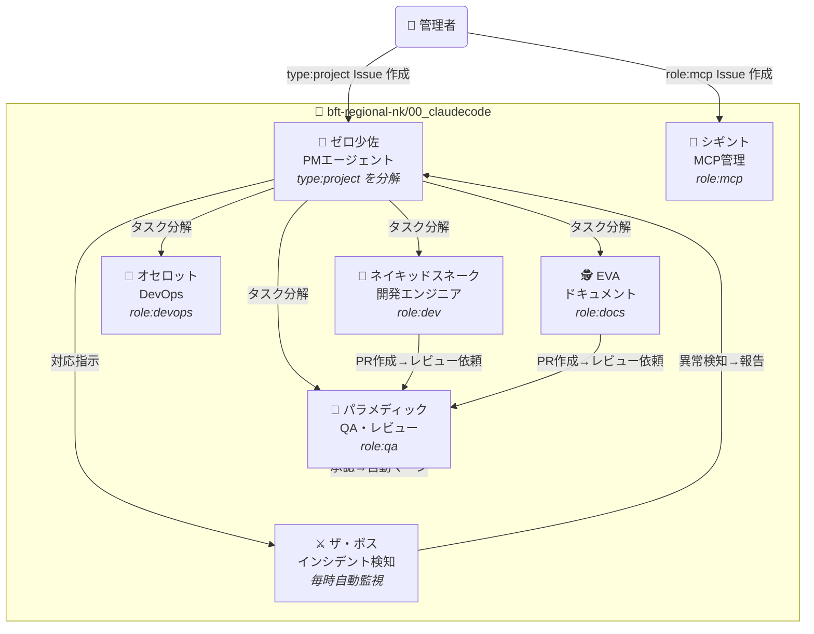

# AI社員システム 司令塔

> **管理者**がゼロ少佐たちに指示を出す組織です。

## 指示の出し方

```
GitHub Issues に type:project または role:xxx ラベルを付けて作成するだけ
```

## 組織図



## エージェント一覧

| キャラ | 役割 | 起動条件 |
|---|---|---|
| ⚔️ **ザ・ボス** | インシデント検知・ゼロ少佐へ報告 | 毎時自動（schedule） |
| 🎯 **ゼロ少佐** | プロジェクト分解・指揮 | `type:project` |
| 🔫 **ネイキッドスネーク** | コード実装 | `role:dev` |
| 🔧 **オセロット** | インフラ・DevOps | `role:devops` |
| 🕵️ **EVA** | ドキュメント生成 | `role:docs` |
| 💊 **パラメディック** | QA・テスト・レビュー | `role:qa` |
| 📡 **シギント** | MCPサーバー管理 | `role:mcp` |

## リポジトリ

| リポジトリ | 用途 |
|---|---|
| [00_claudecode](https://github.com/bft-regional-nk/00_claudecode) | AI社員システム司令塔 |
| [00_powerautomate_hub](https://github.com/bft-regional-nk/00_powerautomate_hub) | Power Automate管理 |
