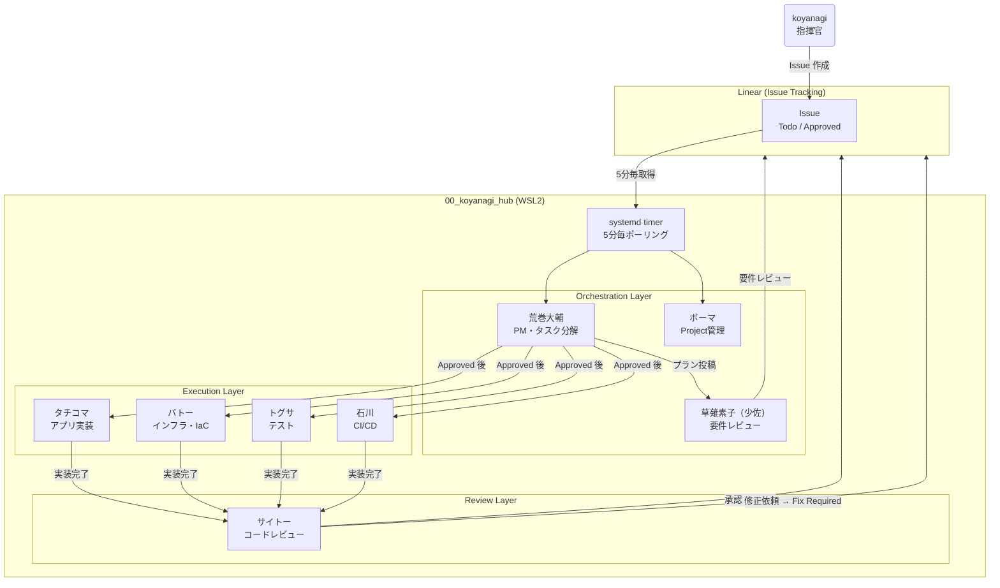

# 公安9課 — AI Agent Organization

> Linear に Issue を置くだけで、攻殻機動隊のメンバーが計画・実装・レビューまで自動で回す。

## 指示の出し方

```
Linear の アクティブ Cycle に Issue を作成して Todo に置く。あとは9課が動く。
```

## 組織図



## エージェント一覧

| キャラ | ラベル | 役割 | 口調 |
|---|---|---|---|
| **荒巻大輔** | `agent:planner` | PM・タスク分解・依存関係整理 | 簡潔・命令形「やれ」 |
| **草薙素子（少佐）** | `agent:architecture` | 要件レビュー・設計判断 | タメ口・鋭い「ここが甘い」 |
| **タチコマ** | `agent:app` | アプリコード実装・PR作成 | 生意気・タメ口「ねぇねぇ」 |
| **バトー** | `agent:infra` | IaC (CDK/Terraform)・AWS | 豪快「任せとけ」 |
| **トグサ** | `agent:test` | テストコード・品質担保 | 刑事気質「ここが怪しい」 |
| **石川** | `agent:devops` | CI/CD・GitHub Actions | 淡々・事実のみ「設定した」 |
| **サイトー** | `agent:review` | コードレビュー・承認判定 | 寡黙「確認した。問題ない」 |
| **ボーマ** | `agent:scrum` | Sprint計画・Project管理 | 実直「整理した」 |
| **タチコマ（監視班）** | `agent:incident` | 異常検知・通知 | 明るい「ねぇ、これヤバくない？」 |

## ワークフロー

```
Todo → In Progress → Plan Review（荒巻プラン + 少佐レビュー）
  → Approved（koyanagi 承認）
  → In Progress → 実装（タチコマ等）→ コードレビュー（サイトー）
  → Done（サイトー承認）or Fix Required（修正依頼）
```

## リポジトリ

### Core

| リポジトリ | 用途 |
|---|---|
| [00_koyanagi_hub](https://github.com/bft-regional-nk/00_koyanagi_hub) | Linear x ClaudeCode 自動化基盤（司令塔） |
| [brain-os](https://github.com/bft-regional-nk/brain-os) | Obsidian Vault → Linear Issue 変換パイプライン |
| [vault](https://github.com/bft-regional-nk/vault) | Obsidian ナレッジベース |

### Applications

| リポジトリ | 用途 |
|---|---|
| [10_vc_automation](https://github.com/bft-regional-nk/10_vc_automation) | VIBE Coding 自動化 |

### Infrastructure / Systems

| リポジトリ | 用途 |
|---|---|
| [20_aws_infra](https://github.com/bft-regional-nk/20_aws_infra) | AWS 基盤構築 (CodePipeline) |
| [20_lambda_cicd](https://github.com/bft-regional-nk/20_lambda_cicd) | Lambda CI/CD |
| [20_sys_condor](https://github.com/bft-regional-nk/20_sys_condor) | Raspberry Pi IoT 監視 |
| [20_ai_agent_backoffice_hub](https://github.com/bft-regional-nk/20_ai_agent_backoffice_hub) | バックオフィス雑務自動化 |

### Management

| リポジトリ | 用途 |
|---|---|
| [00_ai_agent_ops_hub](https://github.com/bft-regional-nk/00_ai_agent_ops_hub) | AI エージェント全体管理・運用標準 |
| [00_powerautomate_hub](https://github.com/bft-regional-nk/00_powerautomate_hub) | Power Automate 連携 |
| [00_obsidian](https://github.com/bft-regional-nk/00_obsidian) | Obsidian 設定・プラグイン管理 |

## 技術スタック

- **AI Engine**: Claude Code (claude-opus-4-6)
- **Issue Tracking**: Linear (GraphQL API)
- **Orchestration**: systemd timer + Bash + Python3
- **Runtime**: WSL2 (Ubuntu)
- **IaC**: AWS CDK (TypeScript)
- **CI/CD**: GitHub Actions
